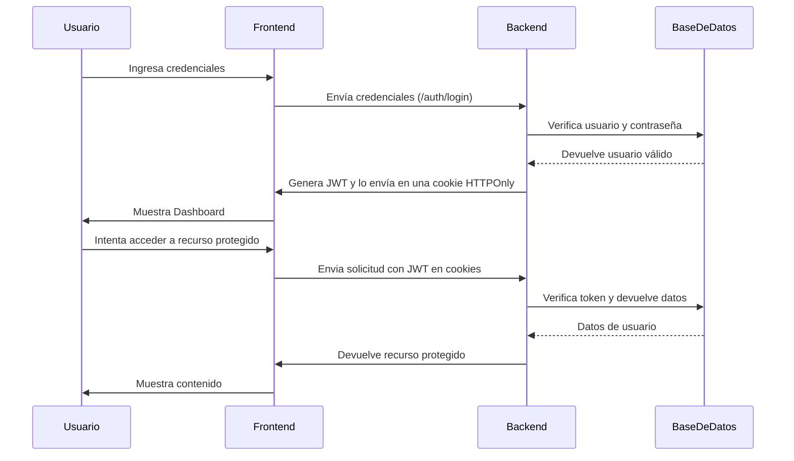

# 📌 Proyecto de Autenticación con TypeScript, Express y React

Este proyecto implementa un sistema de autenticación seguro utilizando JWT, cookies HTTPOnly y encriptación AES. Está compuesto por un **backend en Express con TypeScript** y un **frontend en React con TypeScript**.

---
## 🚀 Instrucciones para ejecutar el proyecto

### **1️⃣ Clonar el repositorio**
```sh
git clone <repo_url>
cd <repo_name>
```

### **2️⃣ Configurar el Backend**
```sh
cd backend
npm install
```

🔹 **Crear un archivo `.env` en la carpeta `backend/` y agregar:**
```env
DB_HOST=localhost
DB_USER=user
DB_PASSWORD=userpassword
DB_NAME=auth_db
JWT_SECRET=supersecretkey
JWT_EXPIRATION=1h
JWT_RENEWAL_LIMIT=10m
AES_SECRET_KEY=my_super_secret_key_32bytes_
AES_IV=my_16bytes_iv_str_
```

### **3️⃣ Configurar la Base de Datos en Docker**
Para levantar **MariaDB** en un contenedor Docker, usa el siguiente `docker-compose.yml`:

```yaml
version: '3.8'

services:
  mariadb:
    image: mariadb:latest
    container_name: mariadb_container
    restart: always
    environment:
      MYSQL_ROOT_PASSWORD: rootpassword
      MYSQL_DATABASE: auth_db
      MYSQL_USER: user
      MYSQL_PASSWORD: userpassword
    ports:
      - "3306:3306"
    volumes:
      - mariadb_data:/var/lib/mysql

volumes:
  mariadb_data:
    driver: local
```

**Ejecutar el contenedor:**
```sh
docker-compose up -d
```

**Acceder a la base de datos dentro del contenedor:**
```sh
docker exec -it mariadb_container mysql -u root -p
```
(Ingresa la contraseña `rootpassword` cuando se te solicite.)

### **4️⃣ Crear la estructura de la base de datos**
Ejecuta los siguientes comandos dentro de **MariaDB**:
```sql
USE auth_db;

CREATE TABLE IF NOT EXISTS users (
    id INT AUTO_INCREMENT PRIMARY KEY,
    name TEXT NOT NULL, -- Se almacenará encriptado
    email TEXT UNIQUE NOT NULL, -- Se almacenará encriptado
    password TEXT NOT NULL, -- Hash con bcrypt
    created_at TIMESTAMP DEFAULT CURRENT_TIMESTAMP NOT NULL
);
```

### **5️⃣ Iniciar el servidor Backend**
```sh
npm run dev
```

### **6️⃣ Configurar el Frontend**
```sh
cd ../frontend
npm install
npm run dev
```

### **7️⃣ Acceder a la Aplicación**
- 📌 **Backend:** `http://localhost:5000`
- 📌 **Frontend:** `http://localhost:5173`
- 📌 **Registro:** `http://localhost:5173/register`
- 📌 **Login:** `http://localhost:5173/login`
- 📌 **Dashboard:** `http://localhost:5173/dashboard`

---
## ⚙️ Tecnologías y herramientas utilizadas

### **🖥️ Backend**
✅ **Express.js con TypeScript**
- Rápido y eficiente para construir APIs.
- Modular y flexible.
- Soporte para TypeScript.

✅ **JWT (JSON Web Tokens) + Cookies HTTPOnly**
- Tokens auto-contenidos para autenticación sin estado.
- Mayor seguridad con Cookies HTTPOnly.

✅ **MariaDB con `mysql2`**
- Ligero y rápido.
- Compatible con MySQL.

✅ **Encriptación AES para datos sensibles**
- Protección de nombres y correos electrónicos.
- Mayor seguridad en almacenamiento de datos.

### **💻 Frontend**
✅ **React con TypeScript**
- Modularidad y reutilización de componentes.
- Seguridad en el desarrollo con tipado estático.

✅ **Material UI**
- Diseño moderno y accesible.
- Componentes fáciles de personalizar.

✅ **Axios para peticiones HTTP**
- Manejo eficiente de solicitudes HTTP.
- Soporte para `withCredentials` y cookies HTTPOnly.

---
## 📌 Explicaciones Técnicas

### **🔹 ¿Qué son las Cookies HTTPOnly/HTTPSOnly?**
Son cookies que solo pueden ser accedidas por el servidor y no por JavaScript del lado del cliente, lo que ayuda a prevenir ataques de **Cross-Site Scripting (XSS)**. Además, las cookies **Secure** solo se envían a través de conexiones HTTPS, garantizando mayor seguridad.

### **🔹 ¿Qué es AES y por qué se usa en este proyecto?**
AES (**Advanced Encryption Standard**) es un algoritmo de cifrado simétrico utilizado para proteger datos sensibles. En este proyecto, se usa **AES-256-CBC** para encriptar nombres y correos electrónicos antes de almacenarlos en la base de datos, asegurando que los datos sean ilegibles sin la clave de descifrado.

### **🔹 ¿Qué es JWT y su uso en autenticación?**
JWT (**JSON Web Token**) es un estándar de autenticación sin estado que permite transmitir información segura entre el cliente y el servidor. En este proyecto, se utiliza para manejar sesiones de usuario, almacenando el token en una **cookie HTTPOnly** para mejorar la seguridad.

---
## 📌 Diagrama de Secuencia del Módulo de Autenticación con JWT

A continuación se muestra el **flujo de autenticación** utilizando **JWT**:


