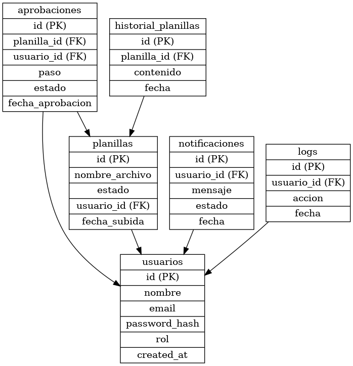

```markdown
# 🎯 Diseño de Arquitectura de Microservicios para Sistema de Planillas 🚀

## 📌 1. Introducción
El presente documento describe el diseño de una arquitectura basada en microservicios para optimizar el sistema de planillas de la empresa. Actualmente, el sistema opera bajo un esquema monolítico y presenta problemas de rendimiento en temporadas de alta demanda. La nueva solución busca mejorar la escalabilidad y eficiencia del proceso.

---
## 🏗️ 2. Arquitectura del Sistema
El sistema se dividirá en los siguientes microservicios:

### 🔐 2.1 Servicio de Autenticación
✅ Integración con OAuth de la empresa (tokens de 12 horas).  
✅ Autenticación complementaria con manejo de permisos.  
🔹 **Tecnologías recomendadas:** OAuth 2.0, JWT, PostgreSQL/MySQL, Redis.  


### 📥 2.2 Servicio de Carga de Planillas
✅ Recepción y procesamiento de archivos CSV.  
✅ Validaciones internas de reglajes.  
🔹 **Tecnologías recomendadas:** Node.js (NestJS), Python (FastAPI), PostgreSQL, RabbitMQ.  


### ✅ 2.3 Servicio de Aprobación de Planillas
✅ Flujo de aprobación en tres pasos por diferentes usuarios.  
🔹 **Tecnologías recomendadas:** Java (Spring Boot), Python (Django), PostgreSQL, Kafka.  


### 🗄️ 2.4 Servicio de Almacenamiento
✅ Gestión de almacenamiento de archivos CSV en la nube o un servidor FTP.  
🔹 **Tecnologías recomendadas:** AWS S3, Google Cloud Storage, MinIO, FTP/SFTP.  


### 📊 2.5 Servicio de Historial
✅ Consulta y descarga de planillas procesadas.  
🔹 **Tecnologías recomendadas:** MongoDB, Elasticsearch, PostgreSQL.  


### 📩 2.6 Servicio de Notificaciones
✅ Envío de correos a empleados al aprobar una planilla.  
🔹 **Tecnologías recomendadas:** AWS SES, SendGrid, SMTP, RabbitMQ.  


### 📜 2.7 Servicio de Logs
✅ Registro de eventos del sistema para auditoría y control.  
🔹 **Tecnologías recomendadas:** ELK Stack (Elasticsearch, Logstash, Kibana), Graylog, Kafka.  


---
## 🔄 3. Comunicación entre Microservicios

🛠️ **Métodos de Comunicación:**  
📡 **APIs REST**: Para interacciones síncronas entre los servicios.  
📨 **RabbitMQ/Kafka**: Para procesos asíncronos como aprobación de planillas y envío de notificaciones.  
📶 **WebSockets (Opcional)**: Para actualizaciones en tiempo real.  

🔄 **Ejemplo de flujo:**  
1️⃣ **Carga de planilla** ➜ Se sube un archivo CSV y se envía a RabbitMQ para su procesamiento.  
2️⃣ **Aprobación** ➜ Se validan los datos y se envía un evento a Kafka.  
3️⃣ **Notificación** ➜ Se envía un correo a los empleados al aprobar la planilla.  


---
## ⚙️ 4. Tecnologías Sugeridas
- 🖥️ **Backend:** Node.js (NestJS), Python (FastAPI/Django), Java (Spring Boot).
- 🗃️ **Base de Datos:** PostgreSQL, MongoDB, MySQL.
- 🔐 **Autenticación:** OAuth 2.0, JWT, Redis.
- ☁️ **Almacenamiento:** Amazon S3, Google Cloud Storage, MinIO, FTP/SFTP.
- 📩 **Notificaciones:** AWS SES, SendGrid, SMTP, RabbitMQ.
- 📊 **Gestión de Logs:** ELK Stack, Graylog.
- 🔄 **Mensajería Asíncrona:** RabbitMQ, Apache Kafka.

---
## 🏛️ 5. Diagrama ER de la Base de Datos


---
## 🎯 6. Conclusión
El diseño propuesto permite una migración eficiente del sistema monolítico a una arquitectura de microservicios, mejorando el rendimiento, escalabilidad y mantenibilidad del sistema de planillas. Se ha establecido una estrategia de comunicación robusta combinando APIs REST y mensajería asíncrona para mejorar la eficiencia del procesamiento de datos.  
